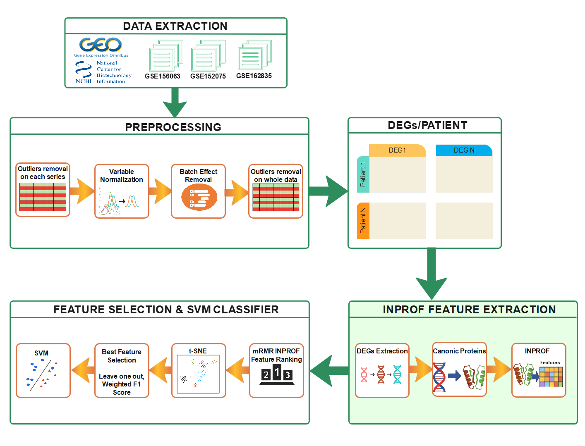

# INPROF-COVID19-Severity
The project consists on three folders:

# Data
It contains 3 folders, one for each NCBI/GEO serie. Each one of these folders contains gene counts file extracted from NCBI/GEO database as well as a file containing severity labels for each patient.
Additionally, all intermediate files with results of each steps are stored in this folder.

# Scripts
This folder contains 6 R scripts with which the exposed results can be reproduced. The entire process is graphically summarized in the following diagram:

The provided scripts are:

## 1-Data_Preprocessing.R
The data are loaded and preprocessed. The script ends with the building of the final gene expression matrix.
## 2-DEGs.R
DEGs are extracted from the gene expression matrix.
## 3-Canonic Proteins.R
DEGs canonical proteins are extracted via UniProt
## 4-INPROF.R
The protein list for each COVID-19 patient is queried from INPROF and a filtered dataset with all patient proteins INPROF information is built.
## 5-tsne+mRMR.R
tSNE algorithm is performed using INPROF data and mRMR feature ranking is computed.
## 6-SVM.R
SVM models are trained using INPROF features incrementally following mRMR feature ranking.

# Plots
The obtained plots from the previous scripts are stored in this folder. These plots are included in the publication.
