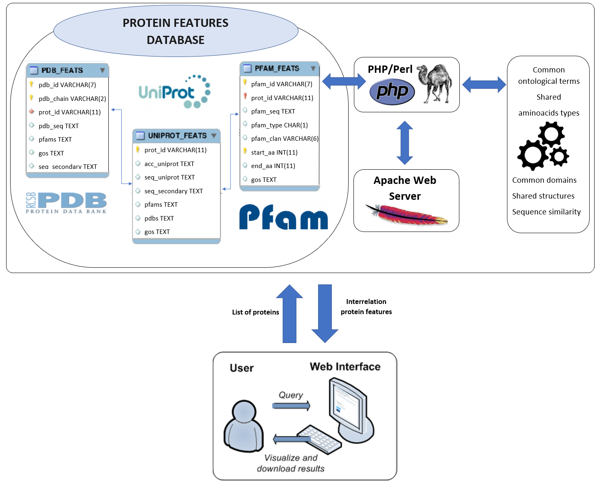

# INPROF

The **INPROF** (**IN**terrelation of **PRO**tein **F**eatures) web server provides an useful tool to retrieve several metrics and information about the relationship (similarities) among a list of proteins. The web server retrieves interrelation data about a wide number of heterogeneous properties (called Categories) like sequences, domains, secondary/tertiary structures or ontological terms. Also, metrics can be obtained taking into account these categories in the alignment of the protein sequences. Up to 46 different metrics can be calculated from this web server to interrelate sets of proteins. The arquitecture used for the INPROF web server is detailed in this scheme:

For more information, please visit this web server at http://www.ugr.es/~fortuno/inprof/inprof.php
